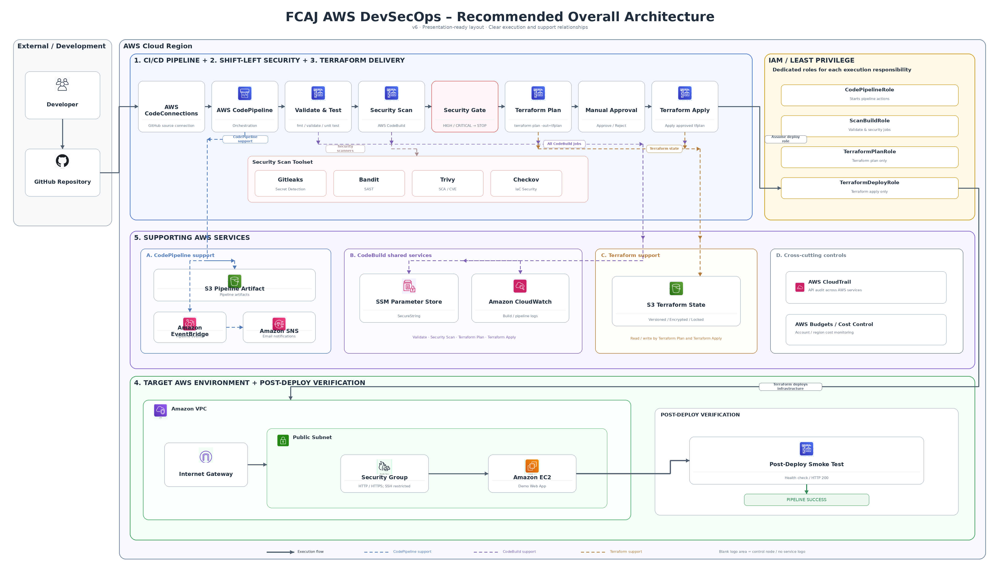

# FCAJ AWS DevSecOps Workshop Project

Complete reference implementation for the FCAJ AWS DevSecOps workshop architecture.



## What this repository implements

The pipeline is intentionally split into explicit gates:

1. GitHub source via AWS CodeConnections.
2. Validate and unit test in AWS CodeBuild.
3. Shift-left security: Gitleaks, Bandit, Trivy, Checkov.
4. Terraform Plan saved as a pipeline artifact.
5. Manual Approval.
6. Terraform Apply using the exact approved binary plan.
7. Post-deploy smoke test against `/health`.
8. CloudWatch logs, EventBridge -> SNS notifications, CloudTrail audit, AWS Budgets.

The target workload is a workshop VPC with an Internet Gateway, public subnet, security group and Amazon EC2 instance running a small Flask application.

## Repository layout

```text
fcaj-aws-devsecops/
├── app/                    # Demo Flask app + unit tests
├── bootstrap/              # S3 state and pipeline artifact buckets
├── platform/               # IAM, CodeBuild, CodeConnections, CodePipeline, SNS, EventBridge, CloudTrail, Budget
├── workload/               # VPC, subnet, SG, EC2 and app bootstrap
├── cicd/                   # Exactly 3 buildspec files
│   ├── buildspec-validate-security.yml
│   ├── buildspec-plan.yml
│   └── buildspec-apply.yml
├── iam-policy/             # IAM JSON templates used by Terraform
├── demo/                   # Intentionally unsafe workshop scenarios
├── docs/architecture-v6.png
└── scripts/
```

## Tool versions used by default

- Terraform CLI: `1.16.2`
- HashiCorp AWS Provider: `~> 6.62`
- Gitleaks: `8.30.1`
- Trivy: `0.74.0`
- Checkov/Bandit: installed from PyPI in the security CodeBuild job

All versions can be changed in `platform/terraform.tfvars` except the provider constraint, which is declared in the Terraform configuration.

## Prerequisites

- AWS account with permissions to create the workshop resources.
- AWS CLI credentials available to Terraform on the administrator workstation.
- Terraform >= 1.16.
- GitHub repository containing this source tree.
- Git installed locally.

Recommended AWS Region for the workshop: `ap-southeast-1`.

## Step 1 - Push this source to GitHub

Create an empty GitHub repository, then push this project before creating the platform.

```bash
git init
git add .
git commit -m "initial FCAJ DevSecOps workshop"
git branch -M main
git remote add origin https://github.com/YOUR_USER/fcaj-aws-devsecops.git
git push -u origin main
```

## Step 2 - Bootstrap state and artifact buckets

Bootstrap uses local Terraform state only for the two S3 buckets. Keep the bootstrap state safe until cleanup.

```bash
cd bootstrap
cp terraform.tfvars.example terraform.tfvars
terraform init
terraform plan
terraform apply
terraform output
```

Record:

- `terraform_state_bucket`
- `pipeline_artifact_bucket`

The state bucket has Versioning, SSE-S3 encryption and Block Public Access enabled. Platform/workload backends use S3 lock files with `use_lockfile=true`.

## Step 3 - Configure the platform

```bash
cd ../platform
cp terraform.tfvars.example terraform.tfvars
```

Edit at minimum:

```hcl
github_owner             = "YOUR_GITHUB_USER_OR_ORG"
github_repo              = "fcaj-aws-devsecops"
terraform_state_bucket   = "BOOTSTRAP_STATE_BUCKET"
pipeline_artifact_bucket = "BOOTSTRAP_ARTIFACT_BUCKET"
notification_email       = "you@example.com"
```

Initialize the platform backend:

```bash
export TF_STATE_BUCKET="BOOTSTRAP_STATE_BUCKET"
export AWS_REGION="ap-southeast-1"
../scripts/init-platform.sh
terraform plan
terraform apply
```

## Step 4 - Complete the GitHub CodeConnection

Terraform creates the AWS CodeConnections connection in `PENDING` state. This is expected.

In AWS Console:

1. Open **Developer Tools -> Settings -> Connections** (or AWS CodeConnections console).
2. Select the connection created by Terraform.
3. Choose **Update pending connection**.
4. Authorize the GitHub App and repository access.
5. Confirm the connection becomes `AVAILABLE`.

Also confirm the SNS email subscription if `notification_email` was configured.

## Step 5 - Run the pipeline

A new GitHub commit triggers the pipeline automatically.

Expected stages:

```text
Source
  -> ValidateTest
  -> SecurityScan
  -> TerraformPlan
  -> ManualApproval
  -> TerraformApply
  -> PostDeployVerification
```

At `ManualApproval`, review `PlanOutput/plan.txt` before approving.

The apply stage consumes the saved `tfplan`; it does not create a new plan after approval.

## Security gate behavior

### ValidateTest

- `terraform fmt -check`
- `terraform validate`
- Python compile check
- Pytest unit tests

### SecurityScan

- Gitleaks: file/directory secret scanning
- Bandit: high-severity Python SAST
- Trivy: HIGH/CRITICAL dependency CVEs
- Checkov: Terraform IaC misconfiguration scanning

The build exits non-zero when a gate fails, stopping the pipeline before deployment.

## SecureString demonstration

`platform` creates a random SSM Parameter Store `SecureString`. The validate/security CodeBuild project injects it using a `PARAMETER_STORE` environment variable. The build verifies the value exists but never prints it.

## IAM model

Four service roles are created:

- `CodePipelineRole`
- `ScanBuildRole`
- `TerraformPlanRole`
- `TerraformDeployRole`

The plan role is read-only for EC2/VPC plus scoped S3 state access. The deploy role receives only the EC2/VPC mutation actions required by this workshop and scoped S3 state/artifact access.

The JSON policy templates are under `iam-policy/` and are rendered by `platform/iam.tf`.

## Demo scenarios

See [`demo/README.md`](demo/README.md).

Included scenarios:

1. Clean successful deployment.
2. Public SSH `0.0.0.0/0` blocked by Checkov.
3. Fake leaked AWS credential blocked by Gitleaks.
4. Vulnerable Python dependency blocked by Trivy.
5. Manual Approval rejection prevents Apply.

Never use a real credential in a demo.

## Local workload access

After a successful deployment:

```bash
export TF_STATE_BUCKET="BOOTSTRAP_STATE_BUCKET"
export AWS_REGION="ap-southeast-1"
./scripts/init-workload-local.sh
terraform -chdir=workload output app_url
terraform -chdir=workload output health_url
```

The PostDeployVerification pipeline stage retries the health endpoint while EC2 user data finishes bootstrapping.

## Cleanup

Clean up in this order so the backend remains available until the end.

### 1. Destroy workload

```bash
export TF_STATE_BUCKET="BOOTSTRAP_STATE_BUCKET"
./scripts/init-workload-local.sh
terraform -chdir=workload destroy
```

### 2. Destroy platform

```bash
cd platform
terraform destroy
```

### 3. Empty versioned S3 buckets if necessary

S3 refuses bucket deletion while object versions remain. If Terraform reports a non-empty state/artifact bucket, remove all object versions/delete markers before destroying bootstrap.

### 4. Destroy bootstrap last

```bash
cd ../bootstrap
terraform destroy
```

## Important workshop limitations

- The target EC2 instance intentionally receives a public IPv4 address to keep the PoC small and observable. Production architecture should normally place application instances in private subnets behind an ALB.
- Public HTTP is intentionally allowed for the demo endpoint and is explicitly documented with a Checkov skip. Public SSH is not part of the baseline.
- `SecureString` values managed by Terraform remain represented in encrypted Terraform state. For production, consider write-only/provider-supported secret workflows or dedicated secret provisioning.
- The source connection requires a one-time GitHub authorization step in the AWS Console.
- Trivy vulnerability data changes over time. The deliberately vulnerable dependency fixture may need refreshing before a live workshop.

## Architecture design rule

The central use case is: unsafe code, dependencies, secrets or Terraform configuration must be detected before AWS infrastructure is changed. Only a clean plan that is manually approved is allowed to reach Terraform Apply.
